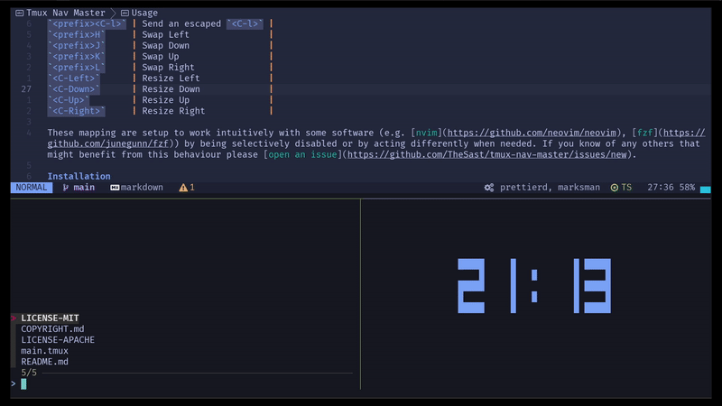

Tmux Nav Master
================

This plugin is *currently* an extended version of [vim-tmux-navigator](https://github.com/christoomey/vim-tmux-navigator) made to complement [Astronvim's default keybindings](https://github.com/AstroNvim/astronvim.github.io/blob/37bbb0894b623eea49000b290b4ce645a97cc47e/docs/Basic%20Usage/mappings.md#general-mappings).  
The goal is to eventually have a great, easy-to-set-up, largely non-intrusive plugin to help with navigation. For this very reason PRs are welcome!

Preview
-------

  

Usage
-----

This plugin provides the following mappings in both "default" and "copy-mode-vi" modes

Mapping         | Action                  |
--------------- | ----------------------- |
`<C-h>`         | Go Left                 |
`<C-j>`         | Go Down                 |
`<C-k>`         | Go Up                   |
`<C-l>`         | Go Right                |
`<prefix><C-h>` | Send an escaped `<C-h>` |
`<prefix><C-j>` | Send an escaped `<C-j>` |
`<prefix><C-k>` | Send an escaped `<C-k>` |
`<prefix><C-l>` | Send an escaped `<C-l>` |
`<prefix>H`     | Swap Left               |
`<prefix>J`     | Swap Down               |
`<prefix>K`     | Swap Up                 |
`<prefix>L`     | Swap Right              |
`<C-Left>`      | Resize Left             |
`<C-Down>`      | Resize Down             |
`<C-Up>`        | Resize Up               |
`<C-Right>`     | Resize Right            |

These mapping are setup to work intuitively with some software (e.g. [nvim](https://github.com/neovim/neovim), [fzf](https://github.com/junegunn/fzf)) by being selectively disabled or by acting differently when needed. If you know of any others that might benefit from this behaviour please [open an issue](https://github.com/TheSast/tmux-nav-master/issues/new).

Installation
------------

1. You can use [TPM](https://github.com/tmux-plugins/tpm) to install this plugin.
2. Add the following line to your `tmux.conf`:
``` tmux
set -g @plugin 'TheSast/tmux-nav-master'
```
3. Install the plugin with <prefix>I, unless you changed `@tpm-install`, in which case you need to use the keybind you set.

Licence
-------

[MIT and Apache 2.0](COPYRIGHT.md)
